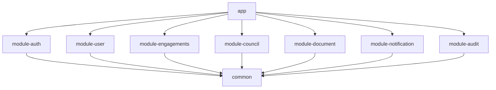
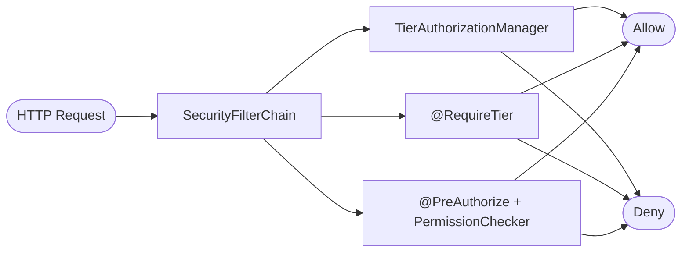

# SC-KPI API


## Overview

Student Council KPI backend API — a Spring Boot 4 modular monolith that powers the digital platform for KPI's Student Council. The application is structured as 9 Gradle subprojects compiled into a single deployable JAR.

## Tech Stack

| Technology | Version | Purpose |
|---|---|---|
| Java | 25 | Language runtime |
| Spring Boot | 4.0.2 | Application framework |
| Spring Security | 6.x | Authentication and authorization |
| Gradle | 8.14 | Build tool (wrapper included) |
| Lombok | 1.18.42 | Boilerplate reduction |
| SpringDoc OpenAPI | 3.0.1 | API documentation (Swagger UI) |
| JaCoCo | 0.8.13 | Code coverage |
| Checkstyle | 10.21.4 | Code style enforcement |
| JUnit 5 | (managed by Spring Boot) | Testing framework |

## Architecture

The project follows a **modular monolith** architecture with 9 Gradle subprojects packaged into a single deployable Spring Boot JAR.



- **app** — Application entry point; aggregates all modules, provides cross-cutting configuration (OpenAPI, async, profiles).
- **common** — Shared infrastructure: exception handling, PBAC security model, port interfaces.
- **module-*** — Domain modules, each owning its controllers and business logic.

## Modules

| Module | Description | Docs |
|---|---|---|
| `app` | Application entry point, OpenAPI config, async config, profiles | [docs/app.md](docs/app.md) |
| `common` | Shared exceptions, PBAC security, port interfaces | [docs/common.md](docs/common.md) |
| `module-auth` | Authentication and security filter chain | [docs/module-auth.md](docs/module-auth.md) |
| `module-user` | User management | [docs/module-user.md](docs/module-user.md) |
| `module-engagements` | Clubs, projects | [docs/module-engagements.md](docs/module-engagements.md) |
| `module-council` | Departments | [docs/module-council.md](docs/module-council.md) |
| `module-document` | Document management | [docs/module-document.md](docs/module-document.md) |
| `module-notification` | Notifications and Telegram integration | [docs/module-notification.md](docs/module-notification.md) |
| `module-audit` | Audit logging for admin oversight | [docs/module-audit.md](docs/module-audit.md) |

## Getting Started

### Prerequisites

- **JDK 25+** (automatically resolved via [Foojay Toolchain](https://github.com/gradle/foojay-toolchains))
- **Gradle 8.14** (wrapper included — use `./gradlew`)

### Build & Run

```bash
# Build all modules
./gradlew build

# Run the application
./gradlew bootRun

# Or run the built JAR directly
java -jar app/build/libs/sc-kpi-api.jar
```

### Configuration

Configuration is managed via `app/src/main/resources/application.yml` and profile-specific overrides. Key environment variables:

| Variable | Default | Description |
|---|---|---|
| `SERVER_PORT` | `8080` | HTTP server port |
| `SPRING_PROFILES_ACTIVE` | `dev` | Active profile (`dev`, `prod`, `test`) |
| `JWT_SECRET` | *(dev default)* | Base64-encoded JWT signing key |
| `JWT_ACCESS_EXPIRATION` | `3600000` (1h) | Access token TTL in ms |
| `JWT_REFRESH_EXPIRATION` | `2592000000` (30d) | Refresh token TTL in ms |
| `JWT_REMEMBER_ME_REFRESH_EXPIRATION` | `7776000000` (90d) | Remember-me refresh TTL in ms |
| `CORS_ORIGINS` | `http://localhost:3000` | Allowed CORS origins |
| `BCRYPT_STRENGTH` | `12` | BCrypt hash strength |
| `API_BASE_URL` | `https://api.sc.kpi.ua` | Base URL used in ProblemDetail type URIs |
| `APP_CONTACT_URL` | `https://sc.kpi.ua` | Contact URL for OpenAPI info |
| `ASYNC_CORE_POOL_SIZE` | `4` | Async executor core threads |
| `ASYNC_MAX_POOL_SIZE` | `8` | Async executor max threads |
| `ASYNC_QUEUE_CAPACITY` | `100` | Async executor queue capacity |

### Profiles

| Profile | Logging | Swagger UI | Notes |
|---|---|---|---|
| `dev` | DEBUG (app + Spring Security) | Enabled | DevTools hot-reload enabled |
| `prod` | WARN | Disabled | API docs disabled entirely |
| `test` | DEBUG (app) | *(default)* | Minimal overrides for testing |

## API Documentation

Swagger UI is available at `/swagger-ui.html` in the `dev` profile. Endpoints are organized into groups:

| Group | Paths |
|---|---|
| 1-auth | `/api/v1/auth/**` |
| 2-users | `/api/v1/users/**` |
| 3-engagements | `/api/v1/clubs/**`, `/api/v1/projects/**` |
| 4-council | `/api/v1/departments/**` |
| 5-documents | `/api/v1/documents/**` |
| 6-notifications | `/api/v1/notifications/**`, `/api/v1/webhooks/**` |
| 7-admin | `/api/v1/admin/**` |

All endpoints require a Bearer JWT token unless listed as public in `SecurityConstants.PUBLIC_URLS`.

## Security Model

The application uses a **Permission-Based Access Control (PBAC)** model built around capability tiers:

| Tier | Level | Display Name |
|---|---|---|
| `GUEST` | 0 | Guest |
| `BASIC` | 1 | Basic |
| `INTERNAL` | 2 | Internal Access |
| `ADVANCED` | 3 | Advanced |
| `SENIOR` | 4 | Senior |
| `ADMIN` | 5 | Administrator |

Authorization is enforced via:
- `TierAuthorizationManager` — programmatic integration with `HttpSecurity`
- `@RequireTier` annotation — declarative tier checks
- `PermissionChecker` — SpEL-friendly bean for `@PreAuthorize` expressions



Context-aware roles (`DepartmentRole`, `ProjectRole`, `PartnerLevel`) map to effective tier levels for scoped authorization.

See [docs/common.md](docs/common.md) for full details.

## Code Quality

- **Checkstyle 10.21.4** — Google-based style rules (`config/checkstyle/`)
- **JaCoCo 0.8.13** — 80% LINE coverage minimum enforced per module
- **JUnit 5 / Mockito** — test framework (via Spring Boot managed dependencies)

Coverage verification runs as part of `./gradlew check`.

## Project Structure

```
sc-kpi-api/
├── app/                          # Application entry point module
│   └── src/main/
│       ├── java/ua/kpi/sc/
│       │   ├── ScKpiApiApplication.java
│       │   └── config/           # AsyncConfig, OpenApiConfig
│       └── resources/
│           ├── application.yml
│           ├── application-dev.yml
│           ├── application-prod.yml
│           └── application-test.yml
├── common/                       # Shared infrastructure
│   └── src/main/java/ua/kpi/sc/common/
│       ├── exception/            # ApiException hierarchy, GlobalExceptionHandler
│       └── security/             # PBAC: tiers, roles, UserPrincipal, ports
├── modules/
│   ├── module-auth/              # Authentication & security filter chain
│   ├── module-user/              # User management
│   ├── module-engagements/       # Clubs, projects (engagements)
│   ├── module-council/           # Departments (council)
│   ├── module-document/          # Document management
│   ├── module-notification/      # Notifications & Telegram webhook
│   └── module-audit/             # Audit logging
├── config/checkstyle/            # Checkstyle configuration
├── docs/                         # Per-module documentation
├── build.gradle                  # Root build script
├── settings.gradle               # Module includes
├── gradle.properties             # Version catalog
└── gradlew / gradlew.bat         # Gradle wrapper
```
