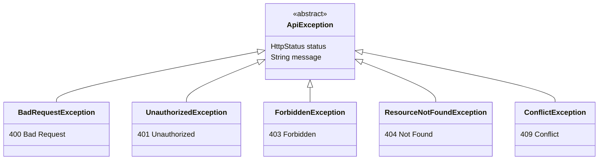

# common

Shared infrastructure module providing exception handling, the PBAC security model, and port interfaces used across all domain modules.

## Dependencies

| Dependency | Scope |
|---|---|
| `spring-boot-starter-web` | API |
| `spring-boot-starter-security` | API |
| `spring-boot-starter-validation` | API |
| `swagger-annotations-jakarta` 2.2.28 | API |
| `jspecify` 1.0.0 | API |
| `spring-boot-starter-test` | Test |
| `spring-security-test` | Test |

All dependencies are exposed with `api` scope so downstream modules inherit them transitively.

## Exception Hierarchy

All application exceptions extend `ApiException`, which carries an `HttpStatus` and a message. The `GlobalExceptionHandler` (`@RestControllerAdvice`) maps these to [RFC 9457](https://www.rfc-editor.org/rfc/rfc9457) `ProblemDetail` responses.



### GlobalExceptionHandler

| Handler | Trigger | Response |
|---|---|---|
| `handleApiException` | Any `ApiException` subclass | ProblemDetail with status, title, detail, type URI (`{apiBaseUrl}/errors/{code}`), and instance URI |
| `handleMethodArgumentNotValid` | `@Valid` validation failures | ProblemDetail with field-level error array (`{apiBaseUrl}/errors/validation`) and instance URI |
| `handleHttpMessageNotReadable` | Malformed request body (e.g. invalid JSON) | 400 ProblemDetail with type URI (`{apiBaseUrl}/errors/400`) and instance URI |
| `handleGenericException` | Any unhandled `Exception` | 500 ProblemDetail with type URI (`{apiBaseUrl}/errors/500`), instance URI; logs stack trace at ERROR level |

All handlers set the RFC 9457 `instance` field to the request URI and the `type` field to a typed error URI.

**Key:** `ResourceNotFoundException` offers a convenience constructor `ResourceNotFoundException(String resource, Object id)` that formats the message as `"{resource} not found with id: {id}"`.

## Security — PBAC Model

The module implements **Permission-Based Access Control** using capability tiers.


### CapabilityTier

Enum defining 6 authorization levels:

| Tier | Level | Display Name |
|---|---|---|
| `GUEST` | 0 | Guest |
| `BASIC` | 1 | Basic |
| `INTERNAL` | 2 | Internal Access |
| `ADVANCED` | 3 | Advanced |
| `SENIOR` | 4 | Senior |
| `ADMIN` | 5 | Administrator |

Methods: `fromLevel(int)`, `isAtLeast(CapabilityTier)`.

### UserPrincipal

Implements Spring Security `UserDetails`. Fields:

| Field | Type | Notes |
|---|---|---|
| `id` | `UUID` | User identifier |
| `email` | `String` | Used as `username` |
| `password` | `String` | Hashed password |
| `tier` | `CapabilityTier` | User's capability level |
| `active` | `boolean` | Maps to `isAccountNonLocked()` / `isEnabled()` |

Granted authority format: `TIER_{level}` (e.g., `TIER_5` for Admin).

### TierAuthorizationManager

Implements `AuthorizationManager<RequestAuthorizationContext>` for programmatic use with `HttpSecurity`:

```java
http.authorizeHttpRequests(auth -> auth
    .requestMatchers("/api/v1/admin/**")
    .access(TierAuthorizationManager.requireTier(CapabilityTier.ADMIN))
);
```

Accepts both `int` and `CapabilityTier` via `requireTier()` factory methods.

### PermissionChecker

Spring-managed bean (`@Component("permissionChecker")`) for use in SpEL expressions:

```java
@PreAuthorize("@permissionChecker.isAdmin()")
```

Methods: `hasTier(int)`, `hasTier(CapabilityTier)`, `isAdmin()`, `isSenior()`, `isAdvanced()`, `isInternal()`, `isBasic()`.

### RequireTier

Annotation for declarative tier checks on methods or types:

```java
@RequireTier(CapabilityTier.ADVANCED)
public void createContent() { ... }
```

Enforced at runtime by `TierMethodAuthorizationManager` via a `AuthorizationManagerBeforeMethodInterceptor` registered by `MethodSecurityTierConfig`. Method-level annotations take precedence over class-level annotations.

### ProblemDetailAccessDeniedHandler

Implements `AccessDeniedHandler` — writes 403 ProblemDetail JSON (`application/problem+json`) with type, title, detail, and instance fields. Ensures Spring Security's `AccessDeniedException` responses follow RFC 9457.

### ProblemDetailAuthenticationEntryPoint

Implements `AuthenticationEntryPoint` — writes 401 ProblemDetail JSON (`application/problem+json`) with type, title, detail, and instance fields. Ensures unauthenticated requests receive RFC 9457-compliant responses.

### SecurityConstants

Static constants:

| Constant | Value |
|---|---|
| `AUTH_HEADER` | `Authorization` |
| `TOKEN_PREFIX` | `Bearer ` |
| `ACCESS_TOKEN_COOKIE` | `access_token` |
| `REFRESH_TOKEN_COOKIE` | `refresh_token` |
| `PUBLIC_URLS` | Auth, clubs, projects, departments, Swagger, actuator health |

## Context-Aware Roles

Authorization can be scoped by context using these enums:

### ContextType

`GLOBAL`, `DEPARTMENT`, `PROJECT`, `PARTNER`

### DepartmentRole

| Role | Effective Tier | Value |
|---|---|---|
| `HEAD` | 4 | `head` |
| `CONTENT_MANAGER` | 3 | `content_manager` |
| `MEMBER` | 2 | `member` |

### ProjectRole

| Role | Effective Tier | Value |
|---|---|---|
| `LEAD` | 4 | `lead` |
| `MEMBER` | 2 | `member` |

### PartnerLevel

| Level | Effective Tier | Value |
|---|---|---|
| `FULL` | 2 | `full` |
| `DOCUMENTS` | 2 | `documents` |
| `BASIC` | 1 | `basic` |

## MFA Enforcement

### RequireMfa

Annotation for enforcing two-factor authentication on methods or types:

```java
@RequireMfa
public void sensitiveAdminOperation() { ... }
```

Enforced at runtime by `MfaMethodAuthorizationManager` via a `AuthorizationManagerBeforeMethodInterceptor` registered by `MethodSecurityMfaConfig` (order 750, runs after tier checks). Verifies that the authenticated user has completed 2FA setup and verification.

### MfaMethodAuthorizationManager

Implements `AuthorizationManager<MethodInvocation>`. Checks if the principal's MFA status is verified by querying `TwoFactorQueryPort`. Denies access if 2FA is required but not completed.

### MethodSecurityMfaConfig

`@Configuration` class that registers the MFA method interceptor at order 750 (after Spring Security's default 600 for `@PreAuthorize` and the custom tier interceptor).

## Audit Infrastructure

### AuditAction

Enum defining all auditable actions: `CREATED`, `UPDATED`, `DELETED`, `TOGGLED`, `LOGIN`, `LOGIN_FAILED`, `LOGOUT`, `REGISTER`, `MFA_ENABLED`, `MFA_DISABLED`, `MFA_VERIFIED`, `MFA_VERIFICATION_FAILED`, `MFA_CHALLENGE_ISSUED`, `MFA_RECOVERY_USED`, `MFA_RECOVERY_REGENERATED`, `PASSWORD_RESET_REQUESTED`, `PASSWORD_RESET_COMPLETED`, `OAUTH_LOGIN`, `OAUTH_LINKED`, `OVERRIDE_ADDED`, `OVERRIDE_REMOVED`, `BULK_TOGGLED`, `NOTIFICATION_BROADCAST`, `NOTIFICATION_CLEANUP`, `NOTIFICATION_PREFERENCES_UPDATED`, `EXPORTED`.

### AuditEntityType

Enum defining auditable entity types: `USER`, `FEATURE_FLAG`, `RATE_LIMIT_RULE`, `NOTIFICATION`, `NOTIFICATION_PREFERENCE`, `AUDIT_LOG`.

### AuditEvent

Immutable record carrying audit event data: `actorId`, `actorEmail`, `action`, `entityType`, `entityId`, `entityName`, `fieldName`, `oldValue`, `newValue`, `details`, `sourceModule`, `ipAddress`, `timestamp`.

### AuditEventBuilder

Fluent builder for `AuditEvent`. Auto-populates `actorId`, `actorEmail`, `ipAddress`, and `timestamp` from the current `SecurityContext` and request.

### AuditPublisher

Port interface for fire-and-forget audit event publishing:

```java
public interface AuditPublisher {
    void publish(AuditEvent event);
}
```

Implemented by `AuditPublisherImpl` in the audit module.

## Notification Infrastructure

### NotificationCategory

Enum: `SECURITY`, `ADMIN`, `SYSTEM`, `FEATURE_FLAG`, `RATE_LIMIT`.

### NotificationChannel

Enum: `IN_APP`, `EMAIL`.

### NotificationEvent

Immutable record: `userId`, `titleKey`, `bodyKey`, `bodyArgs`, `category`, `sourceModule`, `relatedEntityId`, `relatedEntityType`.

### NotificationEventBuilder

Fluent builder for `NotificationEvent`.

### NotificationPublisher

Port interface for async notification publishing:

```java
public interface NotificationPublisher {
    void publishToUser(UUID userId, NotificationEvent event);
    void publishToTier(CapabilityTier minimumTier, NotificationEvent event);
    void publishToAll(NotificationEvent event);
}
```

Implemented by `NotificationPublisherImpl` in the notification module.

## Feature Flag Infrastructure

### FeatureFlag (Annotation)

Annotation for gating methods or classes behind feature flags:

```java
@FeatureFlag("auth.registration")
public void register() { ... }
```

When the flag is disabled, the method throws `ResourceNotFoundException` (404). Processed by `FeatureFlagMethodInterceptor` in the feature-flag module.

### FeatureFlagChecker

Port interface for flag evaluation:

```java
public interface FeatureFlagChecker {
    boolean isEnabled(String key);
    boolean isEnabled(String key, UUID userId, Integer tierLevel);
}
```

Implemented by `FeatureFlagCheckerAdapter` in the feature-flag module.

## JPA Converters

### CapabilityTierConverter

`@Converter(autoApply = true)` — converts `CapabilityTier` enum to/from `Integer` for JPA persistence.

### PartnerLevelConverter

`@Converter(autoApply = true)` — converts `PartnerLevel` enum to/from `String` for JPA persistence.

## Utility Classes

### InputSanitizer

Static utility that strips HTML tags from input strings to prevent XSS.

### PasswordValidator

Static utility that validates password length (8–72 characters, enforced for BCrypt safety).

## Port Interfaces

### UserDetailsPort

Hexagonal boundary for user lookups and mutations, located in the `security` package:

```java
public interface UserDetailsPort {
    Optional<UserPrincipal> loadByEmail(String email);
    Optional<UserPrincipal> loadById(UUID id);
    boolean existsByEmail(String email);
    UserPrincipal createUser(String email, String passwordHash, String firstName, String lastName);
    void updatePassword(UUID userId, String passwordHash);
}
```

This interface is implemented by the user module's persistence layer to decouple the security infrastructure from user storage details.

### TwoFactorQueryPort

Hexagonal boundary for querying 2FA status:

```java
public interface TwoFactorQueryPort {
    boolean isTwoFactorEnabled(UUID userId);
}
```

Implemented by `TwoFactorQueryAdapter` in the auth module.

### UserQueryPort

Hexagonal boundary for querying users across modules:

```java
public interface UserQueryPort {
    List<UUID> findActiveUserIdsByMinimumTier(CapabilityTier minimumTier);
    List<UUID> findAllActiveUserIds();
    Optional<String> getEmailById(UUID userId);
}
```

Implemented by `UserQueryAdapter` in the user module.

## Package Structure

```
ua.kpi.sc.common
├── audit/
│   ├── AuditAction.java
│   ├── AuditEntityType.java
│   ├── AuditEvent.java
│   ├── AuditEventBuilder.java
│   └── AuditPublisher.java
├── exception/
│   ├── ApiException.java
│   ├── BadRequestException.java
│   ├── UnauthorizedException.java
│   ├── ForbiddenException.java
│   ├── ResourceNotFoundException.java
│   ├── ConflictException.java
│   └── GlobalExceptionHandler.java
├── featureflag/
│   ├── FeatureFlag.java              # @FeatureFlag annotation
│   └── FeatureFlagChecker.java
├── notification/
│   ├── NotificationCategory.java
│   ├── NotificationChannel.java
│   ├── NotificationEvent.java
│   ├── NotificationEventBuilder.java
│   └── NotificationPublisher.java
├── security/
│   ├── CapabilityTier.java
│   ├── CapabilityTierConverter.java
│   ├── ContextType.java
│   ├── DepartmentRole.java
│   ├── ProjectRole.java
│   ├── PartnerLevel.java
│   ├── PartnerLevelConverter.java
│   ├── UserPrincipal.java
│   ├── UserDetailsPort.java
│   ├── TwoFactorQueryPort.java
│   ├── UserQueryPort.java
│   ├── RequireTier.java
│   ├── RequireMfa.java
│   ├── PermissionChecker.java
│   ├── SecurityConstants.java
│   ├── authorization/
│   │   ├── TierAuthorizationManager.java
│   │   ├── TierMethodAuthorizationManager.java
│   │   ├── MethodSecurityTierConfig.java
│   │   ├── MfaMethodAuthorizationManager.java
│   │   └── MethodSecurityMfaConfig.java
│   └── handler/
│       ├── ProblemDetailAccessDeniedHandler.java
│       └── ProblemDetailAuthenticationEntryPoint.java
└── util/
    ├── InputSanitizer.java
    └── PasswordValidator.java
```
