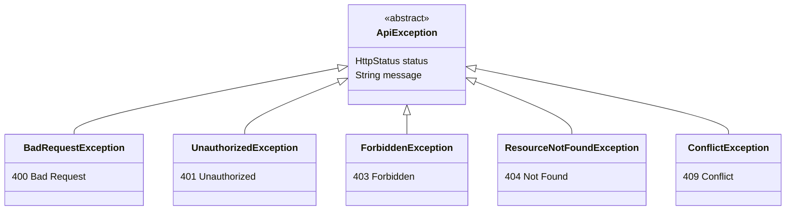
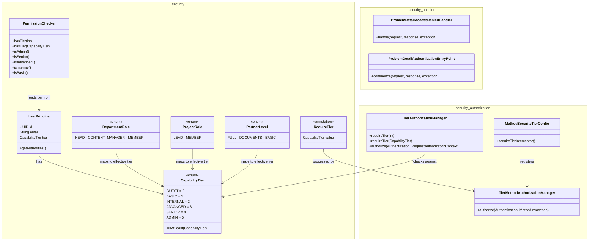

# common

Shared infrastructure module providing exception handling, the PBAC security model, and port interfaces used across all domain modules.

## Dependencies

| Dependency | Scope |
|---|---|
| `spring-boot-starter-web` | API |
| `spring-boot-starter-security` | API |
| `spring-boot-starter-validation` | API |
| `swagger-annotations-jakarta` 2.2.28 | API |
| `jspecify` 1.0.0 | API |
| `spring-boot-starter-test` | Test |
| `spring-security-test` | Test |

All dependencies are exposed with `api` scope so downstream modules inherit them transitively.

## Exception Hierarchy

All application exceptions extend `ApiException`, which carries an `HttpStatus` and a message. The `GlobalExceptionHandler` (`@RestControllerAdvice`) maps these to [RFC 9457](https://www.rfc-editor.org/rfc/rfc9457) `ProblemDetail` responses.



### GlobalExceptionHandler

| Handler | Trigger | Response |
|---|---|---|
| `handleApiException` | Any `ApiException` subclass | ProblemDetail with status, title, detail, type URI (`{apiBaseUrl}/errors/{code}`), and instance URI |
| `handleMethodArgumentNotValid` | `@Valid` validation failures | ProblemDetail with field-level error array (`{apiBaseUrl}/errors/validation`) and instance URI |
| `handleHttpMessageNotReadable` | Malformed request body (e.g. invalid JSON) | 400 ProblemDetail with type URI (`{apiBaseUrl}/errors/400`) and instance URI |
| `handleGenericException` | Any unhandled `Exception` | 500 ProblemDetail with type URI (`{apiBaseUrl}/errors/500`), instance URI; logs stack trace at ERROR level |

All handlers set the RFC 9457 `instance` field to the request URI and the `type` field to a typed error URI.

**Key:** `ResourceNotFoundException` offers a convenience constructor `ResourceNotFoundException(String resource, Object id)` that formats the message as `"{resource} not found with id: {id}"`.

## Security — PBAC Model

The module implements **Permission-Based Access Control** using capability tiers.



### CapabilityTier

Enum defining 6 authorization levels:

| Tier | Level | Display Name |
|---|---|---|
| `GUEST` | 0 | Guest |
| `BASIC` | 1 | Basic |
| `INTERNAL` | 2 | Internal Access |
| `ADVANCED` | 3 | Advanced |
| `SENIOR` | 4 | Senior |
| `ADMIN` | 5 | Administrator |

Methods: `fromLevel(int)`, `isAtLeast(CapabilityTier)`.

### UserPrincipal

Implements Spring Security `UserDetails`. Fields:

| Field | Type | Notes |
|---|---|---|
| `id` | `UUID` | User identifier |
| `email` | `String` | Used as `username` |
| `password` | `String` | Hashed password |
| `tier` | `CapabilityTier` | User's capability level |
| `active` | `boolean` | Maps to `isAccountNonLocked()` / `isEnabled()` |

Granted authority format: `TIER_{level}` (e.g., `TIER_5` for Admin).

### TierAuthorizationManager

Implements `AuthorizationManager<RequestAuthorizationContext>` for programmatic use with `HttpSecurity`:

```java
http.authorizeHttpRequests(auth -> auth
    .requestMatchers("/api/v1/admin/**")
    .access(TierAuthorizationManager.requireTier(CapabilityTier.ADMIN))
);
```

Accepts both `int` and `CapabilityTier` via `requireTier()` factory methods.

### PermissionChecker

Spring-managed bean (`@Component("permissionChecker")`) for use in SpEL expressions:

```java
@PreAuthorize("@permissionChecker.isAdmin()")
```

Methods: `hasTier(int)`, `hasTier(CapabilityTier)`, `isAdmin()`, `isSenior()`, `isAdvanced()`, `isInternal()`, `isBasic()`.

### RequireTier

Annotation for declarative tier checks on methods or types:

```java
@RequireTier(CapabilityTier.ADVANCED)
public void createContent() { ... }
```

Enforced at runtime by `TierMethodAuthorizationManager` via a `AuthorizationManagerBeforeMethodInterceptor` registered by `MethodSecurityTierConfig`. Method-level annotations take precedence over class-level annotations.

### ProblemDetailAccessDeniedHandler

Implements `AccessDeniedHandler` — writes 403 ProblemDetail JSON (`application/problem+json`) with type, title, detail, and instance fields. Ensures Spring Security's `AccessDeniedException` responses follow RFC 9457.

### ProblemDetailAuthenticationEntryPoint

Implements `AuthenticationEntryPoint` — writes 401 ProblemDetail JSON (`application/problem+json`) with type, title, detail, and instance fields. Ensures unauthenticated requests receive RFC 9457-compliant responses.

### SecurityConstants

Static constants:

| Constant | Value |
|---|---|
| `AUTH_HEADER` | `Authorization` |
| `TOKEN_PREFIX` | `Bearer ` |
| `ACCESS_TOKEN_COOKIE` | `access_token` |
| `REFRESH_TOKEN_COOKIE` | `refresh_token` |
| `PUBLIC_URLS` | Auth, clubs, projects, departments, Swagger, actuator health |

## Context-Aware Roles

Authorization can be scoped by context using these enums:

### ContextType

`GLOBAL`, `DEPARTMENT`, `PROJECT`, `PARTNER`

### DepartmentRole

| Role | Effective Tier | Value |
|---|---|---|
| `HEAD` | 4 | `head` |
| `CONTENT_MANAGER` | 3 | `content_manager` |
| `MEMBER` | 2 | `member` |

### ProjectRole

| Role | Effective Tier | Value |
|---|---|---|
| `LEAD` | 4 | `lead` |
| `MEMBER` | 2 | `member` |

### PartnerLevel

| Level | Effective Tier | Value |
|---|---|---|
| `FULL` | 2 | `full` |
| `DOCUMENTS` | 2 | `documents` |
| `BASIC` | 1 | `basic` |

## Port Interface

### UserDetailsPort

Hexagonal boundary for user lookups and mutations, located in the `security` package:

```java
public interface UserDetailsPort {
    Optional<UserPrincipal> loadByEmail(String email);
    Optional<UserPrincipal> loadById(UUID id);
    boolean existsByEmail(String email);
    UserPrincipal createUser(String email, String passwordHash, String firstName, String lastName);
    void updatePassword(UUID userId, String passwordHash);
}
```

This interface is implemented by the user module's persistence layer to decouple the security infrastructure from user storage details.

## Package Structure

```
ua.kpi.sc.common
├── exception/
│   ├── ApiException.java
│   ├── BadRequestException.java
│   ├── UnauthorizedException.java
│   ├── ForbiddenException.java
│   ├── ResourceNotFoundException.java
│   ├── ConflictException.java
│   └── GlobalExceptionHandler.java
└── security/
    ├── CapabilityTier.java
    ├── ContextType.java
    ├── DepartmentRole.java
    ├── ProjectRole.java
    ├── PartnerLevel.java
    ├── UserPrincipal.java
    ├── UserDetailsPort.java
    ├── RequireTier.java
    ├── PermissionChecker.java
    ├── SecurityConstants.java
    ├── authorization/
    │   ├── TierAuthorizationManager.java
    │   ├── TierMethodAuthorizationManager.java
    │   └── MethodSecurityTierConfig.java
    └── handler/
        ├── ProblemDetailAccessDeniedHandler.java
        └── ProblemDetailAuthenticationEntryPoint.java
```
