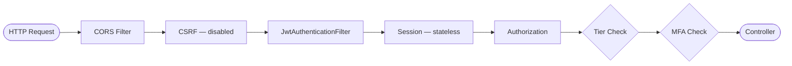
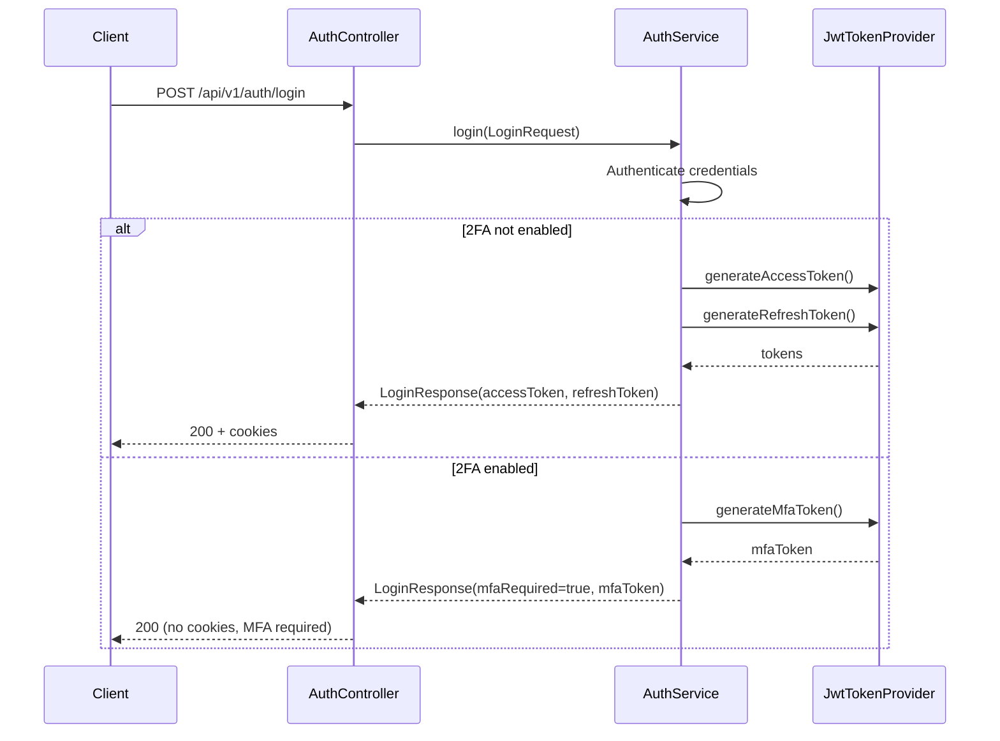
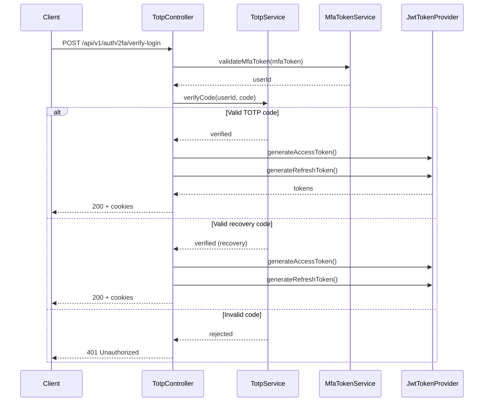
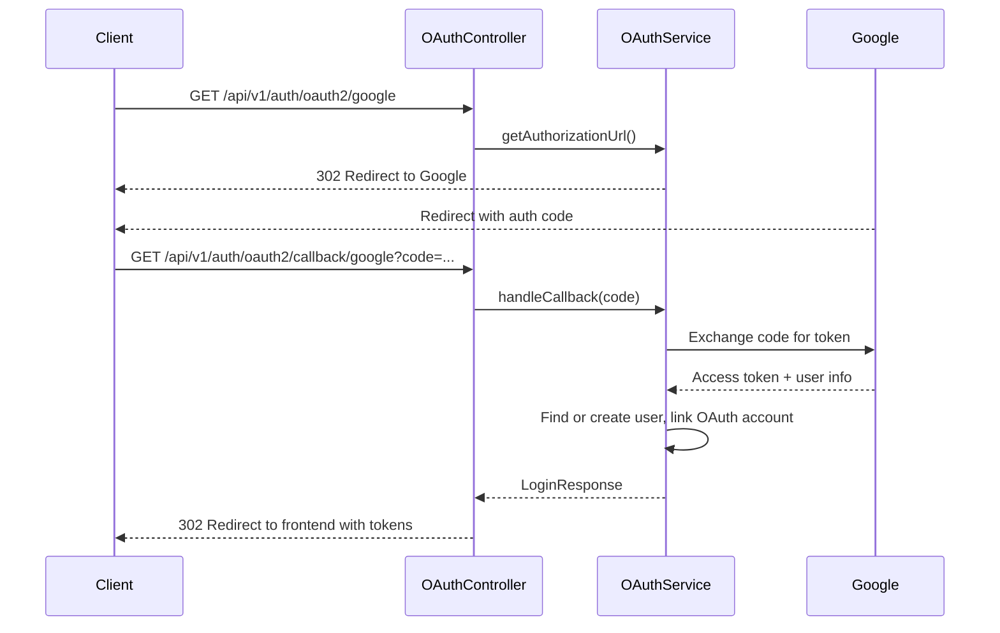
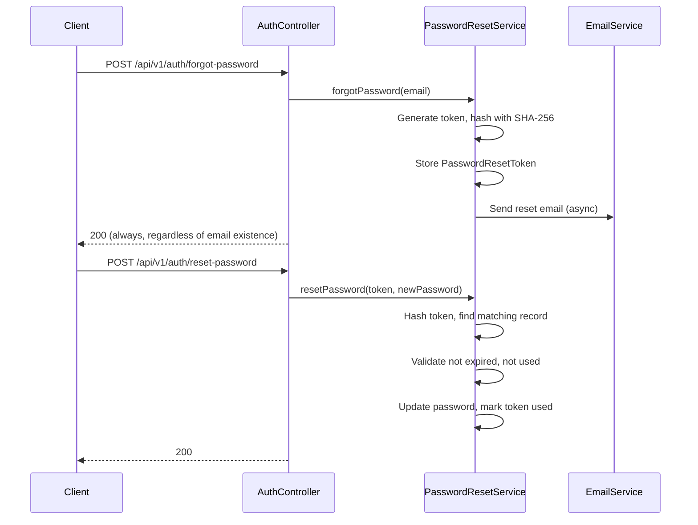

# module-auth

Authentication module responsible for the Spring Security filter chain, JWT authentication, TOTP two-factor authentication, Google OAuth 2.0, password reset, and email delivery.

## Dependencies

| Dependency | Scope |
|---|---|
| `common` | Implementation (project) |
| `spring-boot-starter-data-jpa` | Implementation |
| `spring-boot-starter-mail` | Implementation |
| `jjwt-api` / `jjwt-impl` / `jjwt-jackson` | Implementation (JWT) |
| `dev.samstevens.totp:totp` | Implementation (TOTP) |
| `com.google.zxing:core` / `javase` | Implementation (QR codes) |
| `spring-boot-starter-test` | Test |
| `spring-security-test` | Test |

## Components

### Controllers

#### AuthController

Base path: `/api/v1/auth`. Swagger tag: **Authentication**.

| Method | Endpoint | Auth | Feature Flag | Purpose |
|---|---|---|---|---|
| POST | `/register` | No | `auth.registration` | Register new user |
| POST | `/login` | No | - | Login with credentials |
| POST | `/logout` | Yes | - | Logout and clear tokens |
| POST | `/refresh` | No | - | Refresh access token |
| GET | `/me` | Yes | - | Get current user info |
| POST | `/forgot-password` | No | `auth.password-reset` | Request password reset |
| POST | `/reset-password` | No | `auth.password-reset` | Reset password with token |

#### TotpController

Base path: `/api/v1/auth/2fa`. Swagger tag: **Two-Factor Authentication**.

| Method | Endpoint | Auth | Feature Flag | Purpose |
|---|---|---|---|---|
| POST | `/setup` | Yes | `auth.mfa.totp` | Start TOTP setup |
| POST | `/verify-setup` | Yes | `auth.mfa.totp` | Complete 2FA setup with code |
| GET | `/status` | Yes | `auth.mfa.totp` | Get 2FA status |
| POST | `/disable` | Yes | `auth.mfa.totp` | Disable TOTP 2FA |
| POST | `/recovery-codes/regenerate` | Yes | `auth.mfa.totp` | Regenerate recovery codes |
| POST | `/verify-login` | No | - | Complete 2FA login |

#### OAuthController

Base path: `/api/v1/auth/oauth2`. Swagger tag: **OAuth 2.0**.

| Method | Endpoint | Auth | Feature Flag | Purpose |
|---|---|---|---|---|
| GET | `/google` | No | `auth.oauth2.google` | Initiate Google login |
| GET | `/callback/google` | No | - | Google OAuth callback |

### Services

#### AuthService

Core authentication service handling login, register, refresh, logout, and `/me` operations. Validates credentials via `AuthenticationManager` and delegates token management to `JwtTokenProvider`.

#### TotpService

TOTP two-factor authentication service. Manages setup, verification, disable, and recovery code operations. Recovery codes are generated in batches (10 by default) and stored as SHA-256 hashes.

#### TotpEncryptionService

Encrypts and decrypts TOTP secrets using AES-256-GCM with a random 12-byte initialization vector. The encryption key is sourced from `MfaProperties`.

#### QrCodeService

Generates QR code images as Base64-encoded data URIs for use in TOTP authenticator app enrollment.

#### MfaTokenService

Manages short-lived MFA JWT tokens (5-minute expiration) used during the two-step 2FA login flow. After credentials are verified, an MFA token is issued; the client submits it alongside the TOTP code to complete authentication.

#### OAuthService

Google OAuth 2.0 flow implementation. Handles the authorize redirect, callback token exchange, user resolution, and account linking for existing users.

#### PasswordResetService

Forgot/reset password flow. Generates a password reset token, hashes it with SHA-256 for storage, and sends the reset link via email. Tokens are single-use with configurable expiration.

#### EmailService

Asynchronous email sending service using Spring's `JavaMailSender`.

### Security Components

#### JwtAuthenticationFilter

`OncePerRequestFilter` that extracts JWT tokens from cookies (`access_token`) or the `Authorization` header. Re-queries the database via `UserDetailsPort.loadById()` on every request to ensure the principal reflects the latest user state. Skips processing for public URLs defined in `SecurityConstants.PUBLIC_URLS`.

#### Request Flow



#### JwtTokenProvider

JWT generation and validation using HMAC-SHA256 (JJWT library). Produces three token types:

| Token Type | Expiration | Purpose |
|---|---|---|
| Access token | 1 hour (default) | API authentication |
| Refresh token | 30 days (default) | Token renewal |
| Remember-me refresh token | 90 days (default) | Extended session |
| MFA token | 5 minutes (default) | 2FA login step |

#### CookieUtil

Helper for creating HTTP-only cookies with `SameSite=Lax` policy. The `Secure` flag is configurable via `CookieProperties` to support development over plain HTTP.

#### SecurityFilterChainConfig

Central security configuration class (`@Configuration`, `@EnableWebSecurity`, `@EnableMethodSecurity`):

| Bean | Type | Description |
|---|---|---|
| `filterChain` | `SecurityFilterChain` | Stateless sessions, CSRF disabled, CORS from properties, JWT filter, tier/MFA authorization |
| `corsConfigurationSource` | `CorsConfigurationSource` | URL-based CORS config driven by `CorsProperties` |
| `passwordEncoder` | `PasswordEncoder` | BCrypt with configurable strength (`app.security.bcrypt-strength`) |
| `authenticationManager` | `AuthenticationManager` | Standard Spring Security authentication manager |

#### TwoFactorQueryAdapter

Implements `TwoFactorQueryPort` from the `common` module. Queries `TotpSecretRepository` to determine whether a user has 2FA enabled.

### Entities

#### RefreshToken

Stores hashed refresh tokens for session management.

| Field | Type | Notes |
|---|---|---|
| `id` | `UUID` | Primary key |
| `userId` | `UUID` | Owning user |
| `tokenHash` | `String` | SHA-256 hash of the refresh token |
| `expiresAt` | `Instant` | Token expiration timestamp |
| `createdAt` | `Instant` | Creation timestamp |

#### TotpSecret

Stores encrypted TOTP secrets for 2FA-enrolled users.

| Field | Type | Notes |
|---|---|---|
| `id` | `UUID` | Primary key |
| `userId` | `UUID` | Owning user |
| `encryptedSecret` | `String` | AES-256-GCM encrypted TOTP secret |
| `enabled` | `boolean` | Whether 2FA is active |
| `createdAt` | `Instant` | Creation timestamp |

#### TotpRecoveryCode

Stores hashed recovery codes for 2FA backup access.

| Field | Type | Notes |
|---|---|---|
| `id` | `UUID` | Primary key |
| `userId` | `UUID` | Owning user |
| `codeHash` | `String` | SHA-256 hash of the recovery code |
| `used` | `boolean` | Whether the code has been consumed |
| `usedAt` | `Instant` | Timestamp when used (nullable) |
| `createdAt` | `Instant` | Creation timestamp |

#### OAuthAccount

Links external OAuth provider accounts to internal users.

| Field | Type | Notes |
|---|---|---|
| `id` | `UUID` | Primary key |
| `userId` | `UUID` | Linked internal user |
| `provider` | `String` | OAuth provider name (e.g. `google`) |
| `providerUserId` | `String` | User ID from the provider |
| `email` | `String` | Email from the provider |
| `createdAt` | `Instant` | Creation timestamp |

#### PasswordResetToken

Stores hashed password reset tokens.

| Field | Type | Notes |
|---|---|---|
| `id` | `UUID` | Primary key |
| `userId` | `UUID` | Owning user |
| `tokenHash` | `String` | SHA-256 hash of the reset token |
| `expiresAt` | `Instant` | Token expiration timestamp |
| `used` | `boolean` | Whether the token has been consumed |
| `createdAt` | `Instant` | Creation timestamp |

### DTOs

#### Request DTOs

| DTO | Fields |
|---|---|
| `LoginRequest` | `email`, `password`, `rememberMe` |
| `RegisterRequest` | `email`, `password`, `firstName`, `lastName` |
| `RefreshRequest` | `refreshToken` |
| `TotpVerifyRequest` | `code` |
| `TotpDisableRequest` | `password`, `code` |
| `ForgotPasswordRequest` | `email` |
| `ResetPasswordRequest` | `token`, `newPassword` |

#### Response DTOs

| DTO | Fields |
|---|---|
| `LoginResponse` | `accessToken`, `refreshToken`, `mfaRequired`, `mfaToken` |
| `AuthUserResponse` | `id`, `email`, `firstName`, `lastName`, `tier`, `active`, `mfaEnabled`, `partnerRoles` |
| `TotpSetupResponse` | `qrCodeDataUri`, `manualEntryKey` |
| `TotpStatusResponse` | `enabled`, `recoveryCodesRemaining` |
| `RecoveryCodesResponse` | `codes` (`List<String>`) |

**Note:** `LoginResponse` conditionally includes `mfaRequired` and `mfaToken` when the user has 2FA enabled. In that case, `accessToken` and `refreshToken` are not returned until the 2FA verification step is completed.

### Actuator

#### MfaInfoContributor

Implements `InfoContributor` to expose 2FA statistics at `/actuator/info`:

| Metric | Description |
|---|---|
| Total users with 2FA | Count of users who have set up TOTP |
| Enabled count | Count of users with 2FA currently active |

### Audit Events Published

The module publishes the following audit events via `AuditPublisher`:

| Event | Trigger |
|---|---|
| `REGISTER` | New user registration |
| `LOGIN` | Successful login |
| `LOGIN_FAILED` | Failed login attempt |
| `LOGOUT` | User logout |
| `MFA_CHALLENGE_ISSUED` | MFA token generated (2FA login step 1) |
| `MFA_ENABLED` | User completes 2FA setup |
| `MFA_DISABLED` | User disables 2FA |
| `MFA_VERIFIED` | Successful 2FA code verification |
| `MFA_VERIFICATION_FAILED` | Failed 2FA code verification |
| `MFA_RECOVERY_USED` | Recovery code consumed for login |
| `MFA_RECOVERY_REGENERATED` | Recovery codes regenerated |
| `PASSWORD_RESET_REQUESTED` | Password reset email sent |
| `PASSWORD_RESET_COMPLETED` | Password successfully reset |
| `OAUTH_LOGIN` | OAuth login (new or returning user) |
| `OAUTH_LINKED` | OAuth account linked to existing user |

## Configuration Properties

### JwtProperties

`@ConfigurationProperties(prefix = "jwt")` — JWT token configuration:

| Property | Env Variable | Type | Default |
|---|---|---|---|
| `jwt.secret` | `JWT_SECRET` | `String` | *(dev-only base64 key)* |
| `jwt.access-expiration` | `JWT_ACCESS_EXPIRATION` | `long` | `3600000` (1 hour) |
| `jwt.refresh-expiration` | `JWT_REFRESH_EXPIRATION` | `long` | `2592000000` (30 days) |
| `jwt.remember-me-refresh-expiration` | `JWT_REMEMBER_ME_REFRESH_EXPIRATION` | `long` | `7776000000` (90 days) |

### MfaProperties

`@ConfigurationProperties(prefix = "app.mfa")` — Multi-factor authentication configuration:

| Property | Env Variable | Type | Default |
|---|---|---|---|
| `app.mfa.totp.issuer` | `MFA_TOTP_ISSUER` | `String` | - |
| `app.mfa.encryption-key` | `MFA_ENCRYPTION_KEY` | `String` | - |
| `app.mfa.token-expiration` | `MFA_TOKEN_EXPIRATION` | `long` | `300000` (5 min) |
| `app.mfa.recovery-code-count` | `MFA_RECOVERY_CODE_COUNT` | `int` | `10` |

### CookieProperties

`@ConfigurationProperties(prefix = "cookie")` — Cookie configuration:

| Property | Env Variable | Type | Default |
|---|---|---|---|
| `cookie.secure` | `COOKIE_SECURE` | `boolean` | `false` |

### CorsProperties

`@ConfigurationProperties(prefix = "cors")` — CORS configuration:

| Property | Env Variable | Type | Default |
|---|---|---|---|
| `cors.allowed-origins` | `CORS_ORIGINS` | `List<String>` | `http://localhost:3000` |
| `cors.allowed-methods` | `CORS_METHODS` | `List<String>` | `GET, POST, PUT, PATCH, DELETE, OPTIONS` |
| `cors.allowed-headers` | `CORS_HEADERS` | `List<String>` | `*` |
| `cors.allow-credentials` | `CORS_CREDENTIALS` | `boolean` | `true` |
| `cors.max-age` | `CORS_MAX_AGE` | `long` | `3600` |

### OAuthProperties

`@ConfigurationProperties(prefix = "app.oauth2.google")` — Google OAuth 2.0 configuration:

| Property | Env Variable | Type | Default |
|---|---|---|---|
| `app.oauth2.google.client-id` | `GOOGLE_CLIENT_ID` | `String` | - |
| `app.oauth2.google.client-secret` | `GOOGLE_CLIENT_SECRET` | `String` | - |
| `app.oauth2.google.redirect-uri` | `GOOGLE_REDIRECT_URI` | `String` | - |
| `app.oauth2.google.frontend-url` | `GOOGLE_FRONTEND_URL` | `String` | - |

### PasswordResetProperties

`@ConfigurationProperties(prefix = "app.password-reset")` — Password reset configuration:

| Property | Env Variable | Type | Default |
|---|---|---|---|
| `app.password-reset.token-expiration` | `PASSWORD_RESET_EXPIRATION` | `long` | - |
| `app.password-reset.base-url` | `PASSWORD_RESET_BASE_URL` | `String` | - |

## Authentication Flows

### Standard Login



### 2FA Login Completion



### Google OAuth 2.0



### Password Reset



## Package Structure

```
ua.kpi.sc.auth
├── actuator/
│   └── MfaInfoContributor.java
├── config/
│   ├── SecurityFilterChainConfig.java
│   ├── CorsProperties.java
│   ├── JwtProperties.java
│   ├── MfaProperties.java
│   ├── CookieProperties.java
│   ├── OAuthProperties.java
│   └── PasswordResetProperties.java
├── controller/
│   ├── AuthController.java
│   ├── TotpController.java
│   └── OAuthController.java
├── dto/
│   ├── request/
│   │   ├── LoginRequest.java
│   │   ├── RegisterRequest.java
│   │   ├── RefreshRequest.java
│   │   ├── TotpVerifyRequest.java
│   │   ├── TotpDisableRequest.java
│   │   ├── ForgotPasswordRequest.java
│   │   └── ResetPasswordRequest.java
│   └── response/
│       ├── LoginResponse.java
│       ├── AuthUserResponse.java
│       ├── TotpSetupResponse.java
│       ├── TotpStatusResponse.java
│       └── RecoveryCodesResponse.java
├── entity/
│   ├── RefreshToken.java
│   ├── TotpSecret.java
│   ├── TotpRecoveryCode.java
│   ├── OAuthAccount.java
│   └── PasswordResetToken.java
├── repository/
│   ├── RefreshTokenRepository.java
│   ├── TotpSecretRepository.java
│   ├── TotpRecoveryCodeRepository.java
│   ├── OAuthAccountRepository.java
│   └── PasswordResetTokenRepository.java
├── security/
│   ├── JwtAuthenticationFilter.java
│   ├── JwtTokenProvider.java
│   └── CookieUtil.java
├── service/
│   ├── AuthService.java
│   ├── TotpService.java
│   ├── TotpEncryptionService.java
│   ├── QrCodeService.java
│   ├── MfaTokenService.java
│   ├── OAuthService.java
│   ├── PasswordResetService.java
│   └── EmailService.java
└── adapter/
    └── TwoFactorQueryAdapter.java
```
