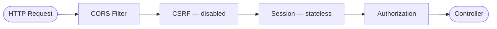

# module-auth

Authentication module responsible for the Spring Security filter chain configuration, CORS, password encoding, and JWT property binding.

## Dependencies

| Dependency | Scope |
|---|---|
| `common` | Implementation (project) |
| `spring-boot-starter-test` | Test |
| `spring-security-test` | Test |

## Components

### SecurityFilterChainConfig

Central security configuration class (`@Configuration`, `@EnableWebSecurity`, `@EnableMethodSecurity`):

| Bean | Type | Description |
|---|---|---|
| `filterChain` | `SecurityFilterChain` | Stateless sessions, CSRF disabled, CORS from properties, currently permits all requests |
| `corsConfigurationSource` | `CorsConfigurationSource` | URL-based CORS config driven by `CorsProperties` |
| `passwordEncoder` | `PasswordEncoder` | BCrypt with configurable strength (`app.security.bcrypt-strength`) |
| `authenticationManager` | `AuthenticationManager` | Standard Spring Security authentication manager |

#### Request Flow



### CorsProperties

`@ConfigurationProperties(prefix = "cors")` — binds CORS configuration from `application.yml`:

| Property | Type | Default |
|---|---|---|
| `cors.allowed-origins` | `List<String>` | `http://localhost:3000` |
| `cors.allowed-methods` | `List<String>` | `GET, POST, PUT, PATCH, DELETE, OPTIONS` |
| `cors.allowed-headers` | `List<String>` | `*` |
| `cors.allow-credentials` | `boolean` | `true` |
| `cors.max-age` | `long` | `3600` |

### JwtProperties

`@ConfigurationProperties(prefix = "jwt")` — binds JWT configuration:

| Property | Type | Default |
|---|---|---|
| `jwt.secret` | `String` | *(dev-only base64 key)* |
| `jwt.access-expiration` | `long` | `3600000` (1 hour) |
| `jwt.refresh-expiration` | `long` | `2592000000` (30 days) |
| `jwt.remember-me-refresh-expiration` | `long` | `7776000000` (90 days) |

### AuthController

Empty controller shell registered at `/api/v1/auth`. Swagger tag: **Authentication**.

## Configuration Properties

| Property Path | Env Variable | Default |
|---|---|---|
| `jwt.secret` | `JWT_SECRET` | *(dev default)* |
| `jwt.access-expiration` | `JWT_ACCESS_EXPIRATION` | `3600000` |
| `jwt.refresh-expiration` | `JWT_REFRESH_EXPIRATION` | `2592000000` |
| `jwt.remember-me-refresh-expiration` | `JWT_REMEMBER_ME_REFRESH_EXPIRATION` | `7776000000` |
| `cors.allowed-origins` | `CORS_ORIGINS` | `http://localhost:3000` |
| `app.security.bcrypt-strength` | `BCRYPT_STRENGTH` | `12` |

## Package Structure

```
ua.kpi.sc.auth
├── config/
│   ├── SecurityFilterChainConfig.java
│   ├── CorsProperties.java
│   └── JwtProperties.java
└── controller/
    └── AuthController.java
```
